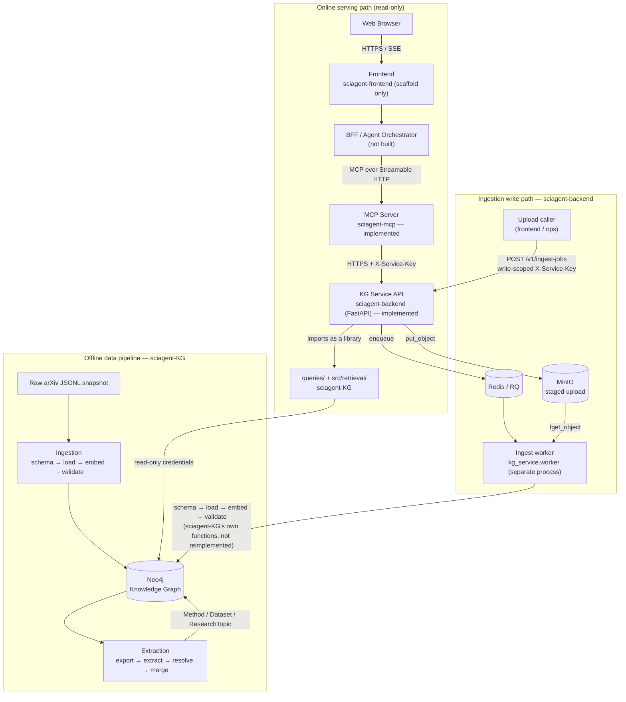

# SciAgent

SciAgent is an AI-powered scientific literature assistant. It combines a
Neo4j knowledge graph of arXiv papers (metadata, embeddings, and extracted
`Method` / `Dataset` / `ResearchTopic` entities) with semantic, keyword, and
graph-based retrieval, exposed to a conversational agent through MCP tools,
so a researcher can search, explore, and ask evidence-backed questions about
the literature instead of reading abstracts one by one.

The full product vision, user stories, and API contracts live in
[`spec/sciagent_webapp_agent_spec.md`](spec/sciagent_webapp_agent_spec.md).
This README covers how the pieces fit together.

## Architecture

The system is split into an **offline data pipeline** that builds the graph
and an **online serving path** that answers user queries against it, plus one
narrow **write path** for adding new papers without touching the CLI. Every
service only talks to its direct neighbor.

**Credential boundary:** `sciagent-KG`'s ingestion/extraction CLIs hold a
*read-write* Neo4j user. `sciagent-backend`'s API process connects with a
separate *read-only* user — it can search, expand, and browse but cannot
write. The one place besides `sciagent-KG`'s CLIs that gets write access is
`sciagent-backend`'s ingest **worker**, a distinct process from the API with
its own credential (`KG_WRITE_NEO4J_*`) that the API process never reads —
see [`sciagent-backend/specs/02-kg-service-architecture.md`](sciagent-backend/specs/02-kg-service-architecture.md)
§8. `sciagent-mcp` never touches Neo4j at all — it only calls `sciagent-backend`
over HTTP, and the agent never gets direct database access.

**Build status:** everything from `sciagent-KG` through `sciagent-mcp` is
implemented and callable end-to-end (MCP tool → KG Service → Neo4j), plus the
ingestion write path (`/v1/ingest-jobs` → MinIO/Redis → worker → Neo4j). The
BFF / Agent Orchestrator layer doesn't exist yet, `sciagent-frontend` is a
scaffold that talks to a mocked API rather than a real upload form, and the
write path has unit-test coverage but no live integration test yet — see
[Repository layout](#repository-layout) for the per-project detail.

## Repository layout

| Path | Role | Status |
|---|---|---|
| [`sciagent-KG/`](sciagent-KG) | Ingests arXiv metadata into Neo4j, computes embeddings, extracts domain entities via LLM, evaluates retrieval quality | Ingestion + extraction complete for the current corpus (36k papers, 128k+ entities) |
| [`sciagent-backend/`](sciagent-backend) | `KG Service` — almost entirely read-only FastAPI wrapper over `sciagent-KG`'s query layer, versioned under `/v1/`, plus `/v1/ingest-jobs` to add new papers | All `/v1/` endpoints implemented (paper lookup, search, graph expansion, entities, stats, ingest-jobs) except `GET /v1/papers/{arxiv_id}/embedding` (`501`); ingest-jobs unit-tested only (no live MinIO/Redis/Neo4j integration test yet); Sprint 4 hardening (load test, dashboards) not started |
| [`sciagent-frontend/`](sciagent-frontend) | Web app: search, paper detail + entities, corpus stats (Next.js + Tailwind) | Scaffolded; renders a plain fallback wherever the backend still returns `501` |
| [`sciagent-mcp/`](sciagent-mcp) | Translates the KG Service's REST API into MCP tools for the agent orchestrator | Implemented — all 11 MCP tools wired to the KG Service, incl. Streamable HTTP integration tests |
| `sciagent-devops/` | Deployment, CI/CD, infrastructure | Not started |
| [`spec/`](spec) | Product-level spec: user stories, API/SSE contracts, NFRs, SDLC | Reference document |
| [`analysis/`](analysis), `data/`, `results/` | Notebooks, raw/sampled arXiv snapshots, and benchmark output used while building the pipeline | — |

Each subproject with its own spec set (`sciagent-KG`, `sciagent-backend`,
`sciagent-mcp`) has a `specs/00-overview.md` that explains its purpose,
non-goals, and how it depends on its neighbors — start there before making
changes.

## Why this shape

- **`sciagent-KG` is a pipeline, not a service.** It has no HTTP surface;
  everything runs as CLI commands or batch jobs. Splitting it out keeps
  expensive, slow, offline work (LLM extraction, embedding) separate from
  anything request/response.
- **`sciagent-backend` is a thin, almost entirely read-only layer.** It
  imports `sciagent-KG`'s query classes as a library rather than
  re-implementing Cypher, so a fix to a query is a fix for every caller.
  Its one write path, `/v1/ingest-jobs`, doesn't reimplement ingestion
  either — it asynchronously re-triggers `sciagent-KG`'s own ingestion
  functions from a separate worker process, so the API process itself stays
  provably read-only even though the service as a whole can now add papers.
- **`sciagent-mcp` never sees the database.** It is a pure translation layer
  (MCP tool call in, KG Service HTTP call out) so the LLM agent's only path
  to data is through an API that's already access-controlled and rate-limited.

## Tech stack

- **Data / KG layer:** Python, `uv`, Neo4j (vector + full-text + graph
  indexes), `sentence-transformers` for embeddings, OpenAI-compatible LLM
  clients (Ollama / vLLM / OpenAI, including the Batch API) for entity
  extraction.
- **Service layer:** FastAPI (`sciagent-backend`), the official `mcp` SDK /
  FastMCP (`sciagent-mcp`).
- **Ingestion write path:** MinIO (S3-compatible staging for uploaded
  metadata files), Redis + RQ (job queue handing work off to a separate
  worker process), Docker Compose (`docker-compose.yml` at repo root) to run
  MinIO/Redis/the KG Service/the worker together locally.
- **Frontend:** Next.js (App Router), TypeScript, Tailwind CSS.

## Getting started

There's no single entrypoint yet — each component is developed and run
independently:

- Build or extend the graph: see [`sciagent-KG/README.md`](sciagent-KG/README.md)
  and the `sciagent-kg-ingest` / `sciagent-kg-extract` skills.
- Run the KG Service API: see [`sciagent-backend/README.md`](sciagent-backend/README.md).
- Add new papers without the CLI (`POST /v1/ingest-jobs`): see
  [`sciagent-backend/README.md`](sciagent-backend/README.md)'s "With the
  ingestion write path" section (needs MinIO + Redis + the ingest worker,
  run together via the root `docker-compose.yml`).
- Run the frontend against it: see [`sciagent-frontend/README.md`](sciagent-frontend/README.md).
- Query the graph directly (search, author/category/year lookup, expansion):
  see the `sciagent-kg` skill.

Current corpus status and known gaps are tracked in
[`sciagent-KG/specs/04-roadmap.md`](sciagent-KG/specs/04-roadmap.md).
